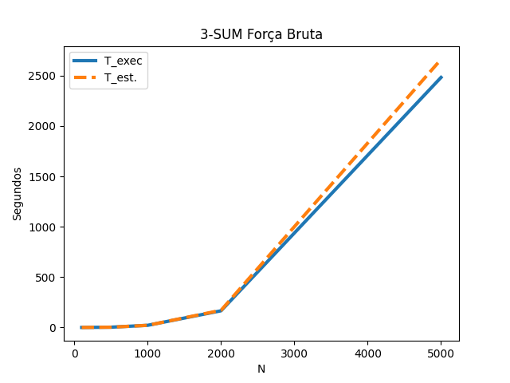
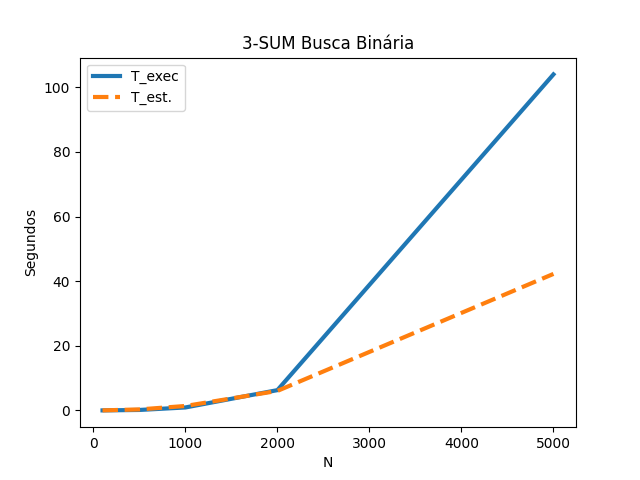
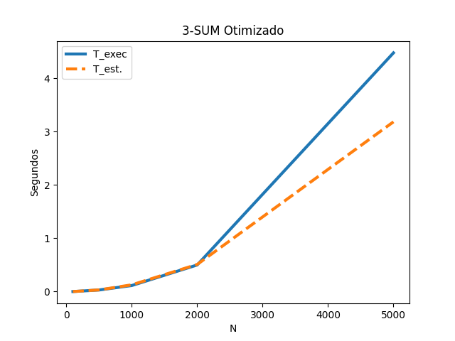
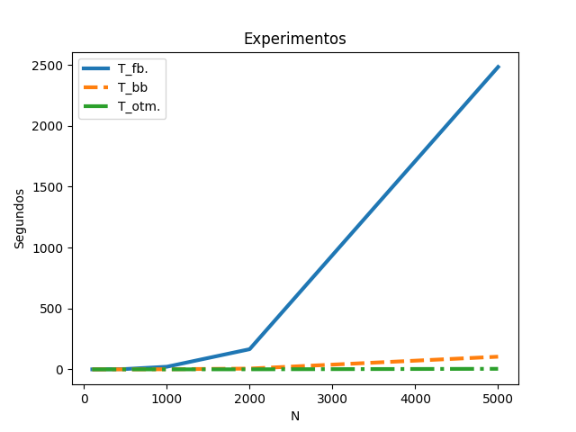

<h1> Exercício 1 - 12/09/2022</h1>

<table style:'border-style:none'>
    <tr>
        <td width="20%">
        <center></center></td>
        <td width="50%">
            UFV - Universidade Federal de Viçosa<br>
            DPI - Departamento de Informática<br>
            Prof. André Gustavo dos Santos<br>
            INF 630 - Projeto e Análise Algoritmos - 2022/1
        </td>
        <td>
            Atividade 1<br>
            Para segunda 12/09/2022
            <br><br>
            Jeronimo Costa Penha - ES 91669
        </td>
    </tr>
</table>
<center><strong>Algoritmos para 3-SUM</strong></center>

O problema 3-Sum consiste em, dado uma lista de *n* números, decidir se existem 3 deles cuja soma seja 0. Na versão desta atividade, considere que deve descobrir todos os conjuntos de 3 com essa propriedade.

1. Algoritmo força-bruta:
    * Implementar o algoritmo força-bruta O(n<sup>3</sup>) comentado na aula
    * Anotar o tempo de execução para diferentes n (ex: 100, 500, 1000, 2000, 5000)
    * Estimar uma função de tempo em função de n: T (n) = ?
    * Verificar se a função de tempo é uma boa estimativa para n maiores (ex: 10000)
2. Comparação de algoritmos
    * Implementar o algoritmo O(n<sup>2</sup> log<sub>2</sub> <sup>n</sup>) com busca binária comentado na aula 
    * Implementar um algoritmo O(n<sup>2</sup>) (pesquise!)
    * Anotar o tempo de execução dos três algoritmos para diferentes n
    * Fazer gráfico comparativo dos tempos dos 3 algoritmos
    * Estimar ou verificar até que valor de n cada algoritmo resolve em 10 segundos

Obs.: não é necessário fazer análise teórica ou estatı́stica dos resultados, trata-se apenas de experimento.

<h2>Resolução</h2>

Para a resolução da atividade foram utilizados:
* Repositório do exercício: [Link.](https://github.com/jeronimopenha/INF_630)
* Um Desktop com o processador Intel(R) Xeon(R) CPU E5-2630 v3 @ 2.40GHz e 64GB de memória RAM DDR4 2133 MHz.
* Sistema Operacional Ubuntu GNU/Linux 20.04.05 x86_64 com kernel 5.15.0-46-generic.
* Linguagem de programação python 3.8.10.
* Visual Studio Code versão 1.71.0.
* Função sort() para vetores em python que possui ordem de complexidade O(n log<sub>2</sub><sup>n</sup>)<sub>.[Ref](https://wiki.python.org/moin/TimeComplexity)</sub>
* Função bisect() para vetores em python que possui ordem de complexidade O(log<sub>2</sub><sup>n</sup>)<sub>.[Ref](https://docs.python.org/3/library/bisect.html#module-bisect)</sub>
* Os gráficos foram gerados com o auxílio da biblioteca Matplotlib.
* Utilização da biblioteca Time para a contagem do tempo de execução.
* Utilização da biblioteca Random para a geração de números aleatórios para os vetores de entrada.
* Execução para 10 listas aleatórias, porém iguais para entre os experimentos, com diferentes conteúdos em cada e utilização do tempo médio das execuções.
* As listas foram ordenadas para cada experimento e o tempo de ordenação não foi levado em consideração para a construção dos gráficos contidos nesse relatório.
* Foram utilizados valores aleatórios -10000 a +10000.
* Os códigos estão no arquivo sum3.py contido neste repositório na pasta src.
* Para a instalação das dependências deste projeto basta executar o comando: pip install -r  requirements.txt 
* Para a execução: python sum3.py
* Após a execução do script, o relatório de cada experimento será exibido no terminal e salvo em arquivos independentes na pasta "retorno".
* Os gráficos são salvos na pasta "graficos".
* Para este documento os gráficos e o relatório de execução estão disponíveis na pasta "relatorio".

<h3>Relatório de execução:</h3>

* Para estimar o tempo de execução para N=5000, foi acrescentada uma constante K<sub>médio</sub> multiplicada à equação de complexidade de cada algoritmo
* A constante K<sub>médio</sub> foi definida com a média das constantes K<sub>N</sub> calculadas para cada instância.
1. Algoritmo 3-SUM Força bruta

    **Código**
    ```
    def sum3_fbruta(vec):
        start = time.time_ns()
        sum3 = []
        qtde_valores = len(vec)
        for i in range(qtde_valores):
            for j in range(i+1, qtde_valores):
                for k in range(j+1, qtde_valores):
                    if vec[i]+vec[j]+vec[k] == 0:
                        sum3.append([vec[i], vec[j], vec[k]])
                        break

        end = time.time_ns()
        return sum3, end - start
    ```

    **Execução:**

    |   N  | T<sub>(s)</sub> | K<sub>(n)<sub> |
    | ---- | --------------- | -------------- |
    |  100 |           0.022 |      2.212e-08 |
    |  500 |           2.782 |      2.225e-08 |
    | 1000 |          21.543 |      2.154e-08 |
    | 2000 |         165.590 |      2.070e-08 |
    | 5000 |        2482.418 |      1.986e-08 |

    * Onde K<sub>(n)</sub> =  T<sub>(n)</sub> / N<sup>3</sup>
    * K<sub>médio</sub> = 2.129e-08
    * T<sub>(n)<sub>(estimado)</sub></sub> = K * N<sup>3</sup>

    **Estimativa de tempos de execução**
    |   N  | T<sub>(s)</sub> | T<sub>(e)<sub>(estimado)</sub></sub> |
    | ---- | -------- | -------- |
    |  100 |    0.022 |    0.021 |
    |  500 |    2.782 |    2.662 |
    | 1000 |   21.543 |   21.295 |
    | 2000 |  165.590 |  170.359 |
    | 5000 | 2482.418 | 2661.860 |
    

    * Para N = 5000, o valor estimado foi de **21294.882s** equivalente a 5h 54m 53s

    **Gráfico com o tempo medido e o tempo estimado**
    </center></td>

    * As estimativas de tempo de execução foram razoavelmente precisas co se considerar as curvas observadas no gráfico, porém verifica-se um aumento na distância entre as curvas para valores maiores. Creio que a estimativa feita possa ser usada para se ter uma ideia da tendência do tempo de execução do algoritmo.

2. Algoritmo 3-SUM N<sup>2</sup>log<sub>2</sub><sup>n</sup>

    **Código**
    ```
    def sum3_bisect(vec):
        vec.sort()
        start = time.time_ns()
        sum3 = []
        qtde_valores = len(vec)
        for i in range(qtde_valores):
            for j in range(i+1, qtde_valores):
                l = (vec[i] + vec[j]) * -1
                k = bisect.bisect_left(vec[j+1:qtde_valores], l)
                if (k + j + 1) != qtde_valores and vec[(k + j + 1)] == l:
                    sum3.append([vec[i], vec[j], vec[k]])

        end = time.time_ns()
        return sum3, end - start
    ```

    **Execução:**

    |   N  | T<sub>(s)</sub> | K<sub>(n)<sub> |
    | ---- | --------------- | -------------- |
    |  100 |           0.003 |      5.176e-08 |
    |  500 |           0.141 |      6.293e-08 |
    | 1000 |           0.911 |      9.139e-08 |
    | 2000 |           6.274 |      1.430e-07 |
    | 5000 |         103.997 |      3.385e-07 |

    * Onde K<sub>(n)</sub> =  T<sub>(n)</sub> / (N<sup>2</sup>log<sub>2</sub><sup>n</sup>)
    * K<sub>médio</sub> = 1.375e-07
    * T<sub>(n)<sub>(estimado)</sub></sub> = K * (N<sup>2</sup>log<sub>2</sub><sup>n</sup>)

    **Estimativa de tempos de execução**
    |   N  | T<sub>(s)</sub> | T<sub>(e)<sub>(estimado)</sub></sub> |
    | ---- | --------------- | ------ |
    |  100 |           0.003 |  0.009 |
    |  500 |           0.141 |  0.308 |
    | 1000 |           0.911 |  1.371 |
    | 2000 |           6.274 |  6.033 |
    | 5000 |         103.997 | 42.249 |

    **Gráfico com o tempo medido e o tempo estimado**
    </center></td>

    * As estimativas de tempo de execução foram mais próximas apenas para os valores menores. Isto pode ter ocorrido por conta da execução desses experimentos terem sido executados em tempos curtos e o cálculo para o k<sub>médio</sub> ter sido afetado por falta de precisão. Imagino que um k<sub>médio</sub> gerado a partir de valores maiores que 500 possam entregar uma previsão mais próxima.

3. Algoritmo 3-SUM N<sup>2</sup>

    
    **Código**
    ```
    def sum3_optimized(vec):
        vec.sort()
        start = time.time_ns()
        sum3 = []
        qtde_valores = len(vec)
        for i in range(qtde_valores):
            j = i+1
            k = qtde_valores - 1
            while (j < k):
                s = vec[i] + vec[j] + vec[k]
                if s > 0:
                    k -= 1
                elif s < 0:
                    j += 1
                else:
                    sum3.append([vec[i], vec[j], vec[k]])
                    j += 1
        end = time.time_ns()
        return sum3, end - start
    ```

    **Execução:**

    |   N  | T<sub>(s)</sub> | K<sub>(n)<sub> |
    | ---- | --------------- | -------------- |
    |  100 |           0.001 |      9.721e-08 |
    |  500 |           0.030 |      1.216e-07 |
    | 1000 |           0.114 |      1.140e-07 |
    | 2000 |           0.500 |      1.249e-07 |
    | 5000 |           4.478 |      1.791e-07 |

    * Onde K<sub>(n)</sub> =  T<sub>(n)</sub> / N<sup>2</sup>
    * K<sub>médio</sub> = 1.274e-07
    * T<sub>(n)<sub>(estimado)</sub></sub> = K * N<sup>2</sup>

    **Estimativa de tempos de execução**
    |   N  | T<sub>(s)</sub> | T<sub>(e)<sub>(estimado)</sub></sub> |
    | ---- | --------------- | ------ |
    |  100 |           0.001 |  0.001 |
    |  500 |           0.030 |  0.032 |
    | 1000 |           0.114 |  0.127 |
    | 2000 |           0.500 |  0.509 |
    | 5000 |           4.478 |  3.184 |

    **Gráfico com o tempo medido e o tempo estimado**
    </center></td>

    * Assim com o ocorrido no experimento anterior, as estimativas de tempo de execução foram mais próximas apenas para os valores menores. Isto pode ter ocorrido por conta da execução desses experimentos terem sido executados em tempos curtos e o cálculo para o k<sub>médio</sub> ter sido afetado por falta de precisão. Imagino que um k<sub>médio</sub> gerado a partir de valores maiores que 500 possam entregar uma previsão mais próxima. Neste caso, creio que a utilização do cálculo estimado possa sinda ser usado como um indicativo de tendência.

4. Gráficos de execução

    Abaixo pode-se observar o gráfico para a execução dos experimentos com os resultados dos trẽs algoritmos juntos.

    </center></td>

    É clara a diferença de desempenho do algoritmo de força bruta para os demais por conta de reduzir 1 na potência da ordem de complexidade, porém a versão otimizada é ainda melhor com o crescimento da curva do tempo de execução mais suave.


5. Estimativa de N para uma execução de 10s para cada algoritmo

    1. Força bruta: N = raiz_cubica(T/K) ~ 777
    2. Com busca binária:
    3. Otimizado: N = raiz_quadrada(T/K) ~ 8860